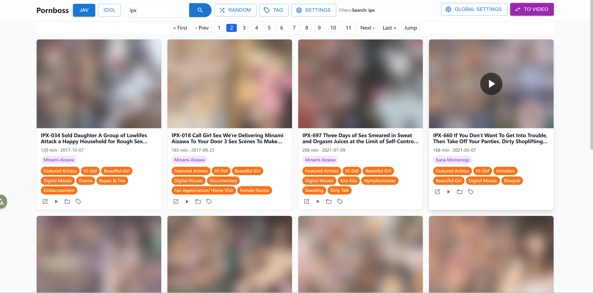
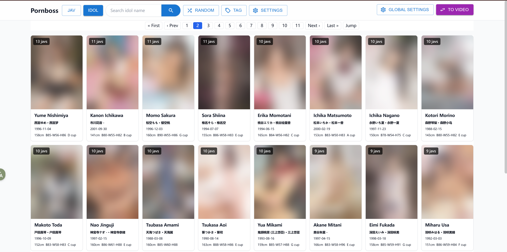
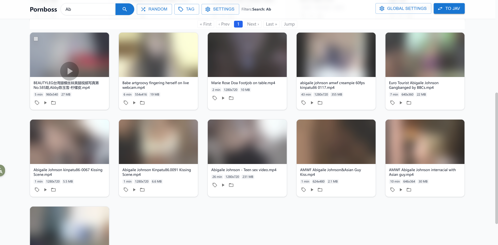
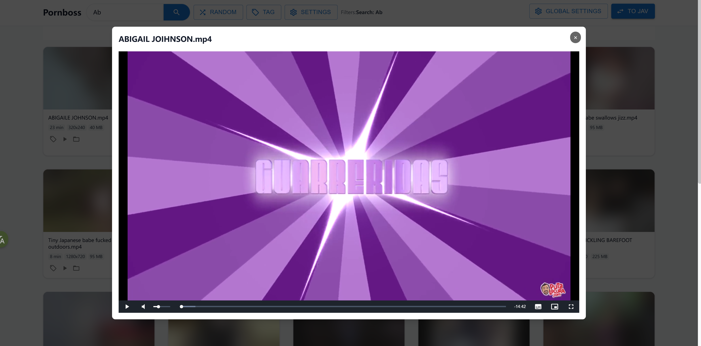

<h1 align="center">Pornboss</h1>

<p align="center">An all-in-one solution for managing a local adult video collection, with support for organizing, browsing, and searching both general videos and Japanese JAV libraries.</p>

<p align="center">
  <a href="https://github.com/JavBoss/pornboss/releases"></a>
  <a href="https://github.com/JavBoss/pornboss/stargazers"></a>
  <a href="https://github.com/JavBoss/pornboss/releases"></a>
  <a href="https://go.dev/"></a>
</p>

<p align="center">
  <a href="./README.md">中文</a> | <a href="./README.en.md">English</a>
</p>

## Keywords

porn manager, jav manager, av manager, jav scraper, jav metadata, adult video manager, pornhub, jav library, javbus, 91, Japanese AV

## Why Pornboss?

**Pornboss is built for people dealing with problems like these**:

- I hoard too many videos, do not have time to watch them all, and have no good way to organize them.
- I want to browse my local JAV library the same way I browse sites like JavBus or JavLibrary, with covers, titles, actresses, and tags.
- Existing local JAV scraping workflows are too complicated, often touch the contents of my folders, and still require too many third-party tools.
- I also keep a lot of short local videos and want to tag them in batches and browse them by collection.
- I want instant playback instead of opening a heavy local media player every time.
- I want random discovery so older forgotten videos can surface again.

## Core Features

- **Ready to use**
  Add your media directories after launch and Pornboss starts scanning and organizing immediately. It can auto-detect a local proxy port, so setup stays simple.

- **Smart directory content management**
  Supports multiple media directories and automatically syncs any changes to their contents, including new files, deletions, and moves. Pornboss never modifies anything inside your folders. All library data is maintained inside Pornboss's own data directory.

- **Simple and intuitive**
  The interface is designed to stay straightforward and focused, without clutter or redundant information, so finding and playing videos stays fast.

- **Actress-centric browsing**
  Browse not only by title, but also by actress, and jump directly into one actress's full library. Actress profiles are fetched automatically and can be sorted in multiple ways, including height, age, and measurements.

- **Automatic code detection and metadata fetching**
  Extracts common JAV identifiers from filenames such as `IPX-633`, `SSIS-001`, and `ipx633_ch`, then fetches the title, release date, actress info, tags, and cover art automatically.

- **Separate management for general videos and JAV**
  Homemade clips, compilations, uncensored fragments, and short videos can stay in the regular library, while coded JAV titles go into the JAV library.

- **Screenshot thumbnails and an in-site player with customizable hotkeys**
  Generates preview screenshots for faster browsing, supports direct playback in the browser, and lets you open the original file or containing folder with one click.

- **Tags, search, random, and sorting**
  Supports batch tagging, bulk tag replacement, and tag-based filtering. You can filter by tags, code, title, actress, play count, and more, with random browsing and multiple sorting options.

## Quick Start

### 1. Download

Go to the [Releases](https://github.com/JavBoss/pornboss/releases) page, download the package for your system, and extract it:

- `windows-x86_64`
- `linux-x86_64`
- `macos-x86_64`
- `macos-arm64`

### 2. Start the App

- Windows: double-click `pornboss.exe`.
If SmartScreen blocks it on first launch, click "More info" and continue.
- macOS: double-click `pornboss.command`.
If macOS says it cannot verify whether `pornboss.command` contains malware that may harm your Mac or compromise your privacy, open `System Settings`, go to `Privacy & Security`, scroll to the bottom, click `Open Anyway`.
- Linux: open a terminal and run `pornboss`.

After launch, Pornboss will try to open your browser automatically. If it does not, open the local address shown in the terminal manually, and do not close the terminal window while Pornboss is running.

### 3. Add Your Media Directories

Open `Global Settings` -> `Directory Management`, then add the local folders that store your videos. Scanning runs quietly in the background, and videos that are already indexed are available immediately.

### 4. Start Using It

- Manage general adult videos in video mode
- Browse JAV titles by code, work, or actress in JAV mode
- Add custom tags such as `favorite`, `subtitled`, `uncensored`, or `must-watch`
- Use search, random browsing, and sorting to find what you want quickly

## Screenshots

<p align="center">
  
</p>

<p align="center">
  
</p>

<p align="center">
  
</p>

<p align="center">
  
</p>

## How to Upgrade

After downloading and extracting a new version, copy the current `data` directory into the new version directory. Keep a backup of your data. Do not move the old directory immediately; it is safer to keep the old version around for a while in case the new version has a serious bug.

## Notes

- Pornboss is a local media library manager, not an online streaming site.
- JAV metadata, cover art, and actress information depend on the availability of external websites.
- When importing a large library for the first time, scanning, cover downloads, and metadata completion will take some time.

## Q&A

- Q: After adding a directory for the first time, how do I know when scanning is finished? Do I need to wait?
- A: Pornboss keeps scanning in the background on a schedule, so you can start using it right after adding a directory and metadata will fill in gradually. You can close the app at any time. Scanning will resume automatically the next time you start it.
</br>

- Q: I downloaded new videos and want them added to the library, or I want to remove videos I no longer want. What should I do?
- A: Just move videos into or out of a managed directory. Pornboss periodically resyncs the full directory state, so you can safely add, move, or delete files without worrying about losing library data.
</br>

- Q: My video folder is on an external drive. If I launch Pornboss without that drive connected, will the index data be lost?
- A: No. Pornboss checks whether each directory exists at startup, and indexed data is stored persistently. Once the drive is connected again, the data will show up normally.
</br>

- Q: How do I move a managed directory?
- A: Move it directly, then update the directory path in directory management.

## Developer Notes

### Development Dependencies

- Go `1.25.1` or later
- Node.js and npm

### Tech Stack

- Backend: Go + Gin + GORM + SQLite
- Frontend: React + Vite + Tailwind + Zustand
- Media probing: `ffmpeg` / `ffprobe`

### Common Commands

Download ffmpeg:

```bash
./scripts/cli.sh download ffmepg
```

Install frontend dependencies:

```bash
cd web
npm install
```

Start the backend:

```bash
./scripts/cli.sh dev backend
```

Start the frontend:

```bash
./scripts/cli.sh dev frontend
```

Frontend checks:

```bash
cd web
npm run lint
npm run build
```

Build a release:

```bash
scripts/cli.sh release linux-x86_64 v0.1.0
```

### Project Structure

```text
cmd/server             Go server entrypoint
internal/db            Database reads and queries
internal/service       Directory scanning, JAV detection, actress info completion
internal/server        HTTP API
internal/manager       Cover downloads and screenshot generation
internal/jav           JAV metadata fetching
web/                   React frontend
scripts/cli            Development and release helper CLI
data/                  Runtime database and cache
```

</details>
