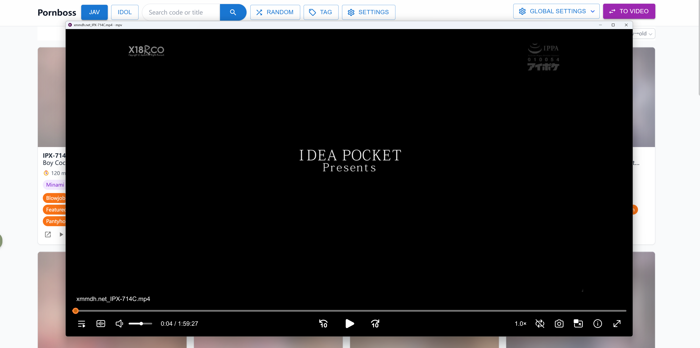
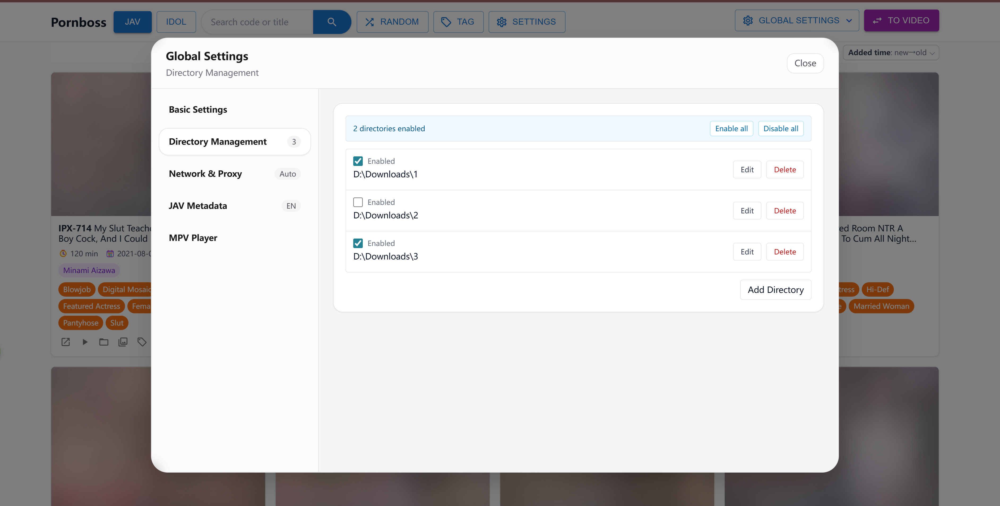
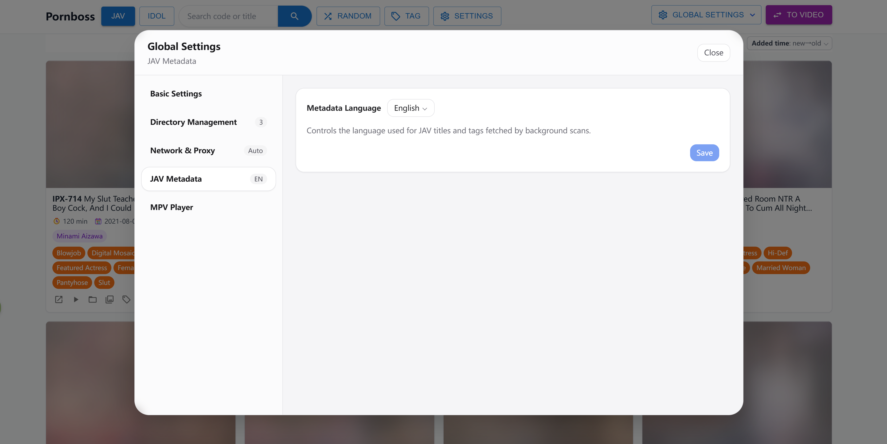
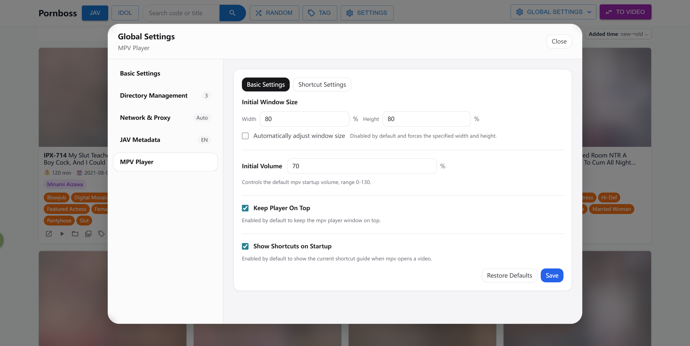
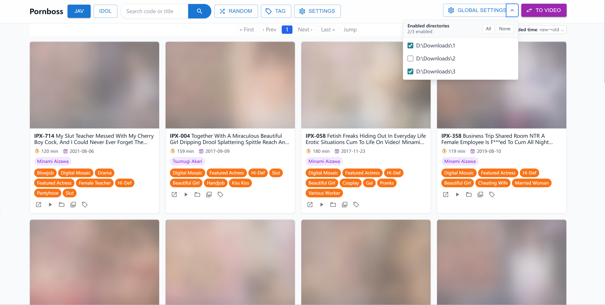

<h1 align="center">Pornboss</h1>

<p align="center">An all-in-one local adult media library: detect JAV codes, fetch metadata, manage folders and tags, and play videos quickly through the bundled mpv integration.</p>

<p align="center">
  <a href="https://github.com/JavBoss/pornboss/releases"></a>
  <a href="https://github.com/JavBoss/pornboss/stargazers"></a>
  <a href="https://github.com/JavBoss/pornboss/releases"></a>
  <a href="https://go.dev/"></a>
</p>

<p align="center">
  <a href="./README.md">中文</a> | <a href="./README.en.md">English</a>
</p>

## Keywords

porn manager, jav manager, av manager, jav scraper, jav metadata, adult video manager, pornhub, jav library, javbus, 91, Japanese AV

## What Is Pornboss?

Pornboss is a local media library manager for large collections of adult videos, JAV titles, short clips, compilations, and removable-drive libraries. It does not modify your video folders. Instead, scan indexes, tags, covers, thumbnails, and metadata are stored inside the project's `data/` directory.

If you want to browse your local collection like JavBus or JavLibrary, without manually editing files, maintaining NFO files, or wiring together multiple tools, Pornboss brings the workflow into a simple Web UI.

## Core Features

### 1. Automatic JAV Code Detection And Metadata Fetching

Pornboss extracts JAV codes from filenames, including common patterns such as `IPX-633`, `SSIS-001`, and `ipx633_ch`, then places recognized videos into the JAV library.

- Automatically fetches JAV title, release date, cover art, actresses, tags, and other metadata.
- Automatically fetches and completes actress profiles, with actress-centric browsing supported.
- Supports Chinese and English JAV metadata fetching, freely switchable.
- Supports filtering and sorting by code, title, actress, tag, duration, release date, play count, and more.
- Keeps general videos and JAV titles separate, so homemade clips, short videos, compilations, and uncensored fragments do not get mixed with coded JAV titles.

### 2. Smart Folder Management And Portable Data

After you add local media folders, Pornboss continuously syncs their contents in the background. Folder changes are detected and refreshed promptly, so newly added, removed, or moved files are reflected in the media library. Indexed videos can be browsed immediately while scanning and metadata completion continue in the background.

- Supports multiple media folders, including local disks, NAS mounts, and removable drives.
- Lets you freely choose enabled folders, with disabled folder content hidden automatically.
- Keeps historical index data when a folder is temporarily unavailable, so removable-drive libraries reappear after the drive is connected again.
- Binds tags, JAV associations, and metadata to video fingerprints, so common move and rename workflows do not require retagging.
- Stores the database, covers, thumbnails, and runtime data under `data/`; copy this directory to upgrade or migrate.

### 3. Built-In mpv Playback

Pornboss integrates mpv playback, so clicking a video can launch a lightweight, high-performance local player that handles large files, high bitrates, and many common video formats.

- Plays the original local file through mpv, avoiding browser playback format limitations.
- Supports playback options such as default volume, window size, and always-on-top behavior.
- Supports custom hotkeys for actions such as seeking and volume adjustment.
- Bundles the [ModernZ](https://github.com/Samillion/ModernZ) OSC script, so mpv playback uses a more modern on-screen player UI by default.
- Supports taking screenshots at any moment during mpv playback, saved per video under `data/video/{video_id}/screenshot/`.
- In both the video library and JAV library, the screenshot panel previews all mpv screenshots in timestamp order.
- The screenshot panel supports enlarged previews, deleting screenshots, and resuming playback directly from a screenshot timestamp.
- Lets you choose the default player in global settings, supports playback through mpv or the system player, and can reveal the file in its containing folder.

### 4. Simple, Practical UI

The frontend is designed around finding the right video quickly. Common operations are centered on filtering, sorting, tagging, and random discovery instead of dense configuration screens.

- Supports a general video library, a JAV title library, and actress-centric browsing.
- Supports search, tag filters, multi-select batch tagging, and bulk tag replacement.
- Supports random browsing so older forgotten videos can surface again.
- Supports sorting by recently added, filename, duration, release date, play count, and more.

## Quick Start

### 1. Download

Go to the [Releases](https://github.com/JavBoss/pornboss/releases) page, download the package for your system, and extract it:

- `windows-x86_64`
- `linux-x86_64`
- `macos-x86_64`
- `macos-arm64`

### 2. Start The App

- Windows: double-click `pornboss.exe`. If SmartScreen blocks it on first launch, click "More info" and continue.
- macOS: double-click `pornboss.command`. If macOS cannot verify the file, open `System Settings` -> `Privacy & Security`, scroll to the bottom, and click `Open Anyway`.
- Linux: open a terminal and run `pornboss`.

After launch, Pornboss will try to open your browser automatically. If it does not, open the local address shown in the terminal manually. Keep the terminal window open while Pornboss is running.

The release package includes a `config.toml` file in its root directory. By default `port = 0`, so Pornboss uses a random startup port. To use a fixed port, set it like this:

```text
port = 17654
```

### 3. Set JAV Metadata Language

Open `Global Settings` -> `JAV Metadata`, switch the metadata language to `English`, and save.

### 4. Add Your Media Folders

Open `Global Settings` -> `Directory Management`, then add the local folders that store your videos. Scanning runs in the background, and indexed videos are available immediately without waiting for the full scan to finish.

### 5. Start Using It

- Manage general adult videos, short clips, and compilations in `Video` mode.
- Browse JAV titles by code, title, tag, and actress in `JAV` mode.
- Choose the folders you want to browse from the top folder dropdown or `Directory Management`.
- Add custom tags such as `favorite`, `subtitled`, `uncensored`, or `must-watch`.
- Use search, filters, sorting, and random browsing to find content quickly.

## Screenshots

<p align="center">
  
</p>

<p align="center">
  
</p>

<p align="center">
  
</p>

<p align="center">
  
</p>

<p align="center">
  
</p>

<p align="center">
  
</p>

<p align="center">
  
</p>

<p align="center">
  
</p>

<p align="center">
  
</p>

<p align="center">
  
</p>

<p align="center">
  
</p>

<p align="center">
  
</p>

## How To Upgrade Versions

After downloading and extracting a new version, copy the old version's `data/` directory into the new version directory. Keep the old version and a data backup until you confirm the new version runs correctly.

## Notes

- Pornboss is a local media library manager, not an online streaming site.
- JAV metadata, cover art, and actress information depend on external website availability. If access is restricted in your region, prepare a working network/proxy environment yourself.
- When importing a large library for the first time, scanning, cover downloads, metadata completion, and thumbnail generation can take some time.
- Pornboss does not modify your video files or folder structure. Indexes and extended data are stored under `data/`.

## Q&A

- Q: Why is Pornboss a local web app instead of a desktop app?
- A: This is not a technical limitation. It is mainly a user experience choice. For example, browsers have several unique advantages:
  1. If you want to view JAV titles from actress A and actress B while searching for videos containing keyword C, you can simply open multiple browser tabs.
  2. If you want to open a new page without losing the current page, use Ctrl + click or right-click and choose to open it in a new tab.
  3. If you click the wrong thing, the browser back button takes you back immediately.
  4. If you see a JAV title or actress name and want to search for it, select the text, right-click, and search it with Google.

<br>

- Q: After adding a folder, how do I know when scanning is finished? Do I need to wait?
- A: No. Pornboss scans and completes metadata in the background, so you can start using it right after adding a folder. You can also close the app at any time; scanning will continue the next time it starts.

<br>

- Q: After adding a folder, why do my JAV videos appear in regular video mode?
- A: This is expected. JAV metadata fetching has some delay compared with video scanning, so JAV videos may first appear as regular videos. If external network access is working, wait a moment and they will disappear from regular video mode and appear in JAV mode.

<br>

- Q: How do I add newly downloaded videos or remove videos I no longer want?
- A: Move videos into or out of a managed folder. Pornboss syncs folder state, so additions, moves, and removals are reflected in the library.

<br>

- Q: My video folder is on a removable drive. Will data be lost if I start Pornboss without the drive connected?
- A: No. When a folder is unavailable, Pornboss keeps the indexed data. The library will reappear after the drive is connected again.

<br>

- Q: One removable drive is running out of space. What should I do if I need to move the folder to a new drive?
- A: Move the folder directly, then update its path in `Directory Management`. You do not need to worry about data loss; Pornboss will handle it.

<br>

- Q: How do I migrate to another computer?
- A: For the same operating system, copy the entire Pornboss directory to the new computer and run it directly. For cross-platform migration, download the matching Pornboss package on the new computer, then copy the old computer's `data/` directory into the new Pornboss directory. If your video folder paths also changed, update them manually in `Directory Management`.

## Developer Notes

### Development Dependencies

- Go `1.25.1` or later
- Node.js and npm

### Tech Stack

- Backend: Go + Gin + GORM + SQLite
- Frontend: React + Vite + Tailwind + Zustand
- Media probing: `ffprobe`
- Thumbnail screenshot generation: `ffmpeg` on macOS, `mpv` on other platforms
- Playback and manual screenshots: `mpv`

### Common Commands

Download dependencies (`ffprobe` + `mpv`, plus `ffmpeg` on macOS):

```bash
./scripts/cli.sh download linux-x86_64
```

Install frontend dependencies:

```bash
cd web
npm install
```

Start the backend:

```bash
./scripts/cli.sh dev backend
```

Start the frontend:

```bash
./scripts/cli.sh dev frontend
```

Frontend checks:

```bash
cd web
npm run lint
npm run build
```

Build a release:

```bash
scripts/cli.sh release linux-x86_64 v0.1.0
```

### Project Structure

```text
cmd/server             Go server entrypoint
cmd/javprovider        JAV metadata provider debug entrypoint
internal/common        Shared global state and configuration
internal/db            GORM queries and SQLite storage
internal/jav           JAV metadata and actress profile fetching
internal/manager       Cover download and screenshot jobs
internal/models        Data model definitions
internal/mpv           mpv playback, hotkey, and manual screenshot configuration
internal/server        HTTP API and static asset routing
internal/service       Folder scanning, JAV detection, metadata completion
internal/util          File, system, proxy, and video probing utilities
web/                   React + Tailwind frontend
scripts/cli            Development, dependency download, and release helper CLI
data/                  Runtime database, covers, thumbnails, and cache
```
