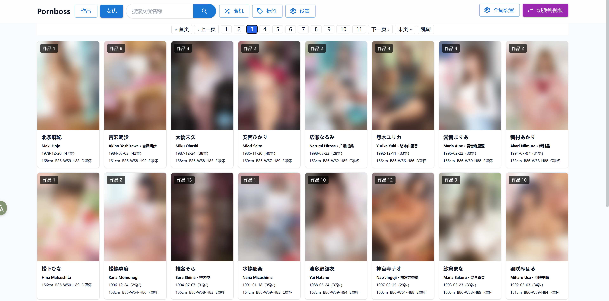
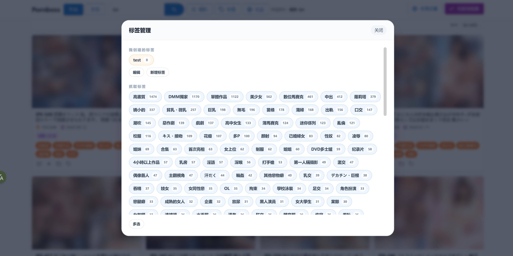
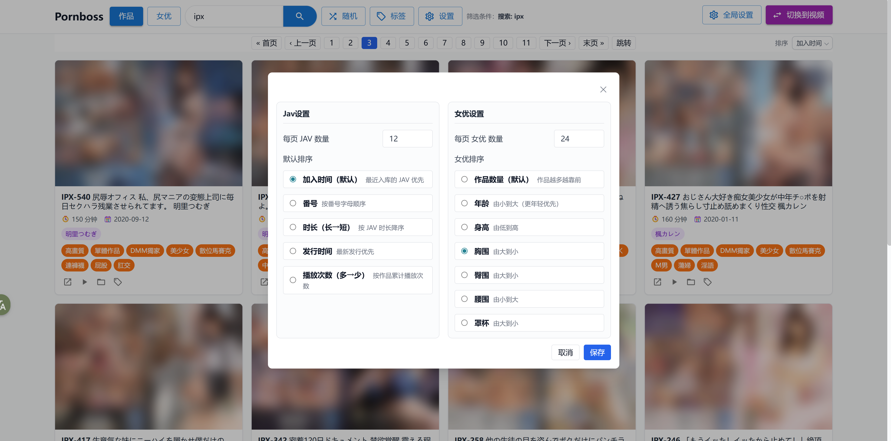

# Pornboss

Pornboss 是一个面向本地成人视频收藏的一站式解决方案，同时覆盖普通成人视频管理和日本 JAV 管理。

## Keywords
Porn, Pornhub, PornManager, Jav, JavScraper

## Why pornboss?

**如果你也有以下困扰，那么pornboss将是你的完美选择**：

- 我是个仓鼠症患者，下了一大堆片，很多都来不及观看，也不知道怎么整理。
- 我希望能向浏览javBus，javLibrary那样浏览我本地的jav（标签、封面、标题、演员）。
- 目前已有的本地jav搜刮整理方案都太复杂，需要下载各种第三方工具，而且也不是非常好用。
- 我还有很多91的国产小视频，我希望给它们批量打上不同的标签，想看哪个合集就可以直接搜寻。
- 我希望视频播放更加快捷，点击立刻播放，而不是打开一个很重的本地播放器。
- 我希望有视频随机选取、展示功能。这样那些很久之前下载的被遗忘的视频也有机会能再次看到。

## 核心功能

- **开箱即用**
  不需要折腾任何复杂第三方工具，启动后添加目录就能开始扫描和整理，自动识别本地代理端口，小白也能轻松上手。

- **自动识别番号**
  从文件名提取 `IPX-633`、`SSIS-001`、`ipx633_ch` 这类常见格式，自动识别 JAV 作品。

- **作品自动聚合**
  同一番号下的多个文件会合并到同一条作品记录里，适合管理分段版、字幕版、不同清晰度版本。

- **女优视角浏览**
  不只按作品看，还可以按女优聚合浏览，快速进入某位女优的全部作品。

- **自动抓取标题、演员、标签、封面**
  编号识别成功后，会补全 JAV 标题、发行时间、演员信息、作品标签，并自动下载封面。

- **普通视频与 JAV 分开管理**
  自拍、合集、无码片段、短视频可以走普通视频库；番号片则进入 JAV 库，结构更清晰。

- **本地目录自动扫描**
  支持多个资源目录，自动发现新文件、更新文件信息，并持续维护媒体库状态。

- **截图缩略图 + 站内播放**
  自动生成视频截图，浏览更高效；支持在页面里直接播放，也可以一键打开原文件或所在目录。站内播放器支持自定义快捷键，解放你的双手。

- **视频批量打标签和强大的标签管理**
  支持批量打标签、批量替换标签、按标签筛选查询；普通视频标签和 JAV 标签分开管理，整理大库更高效。

- **标签、搜索、随机、排序**
  支持按标签、番号、标题、女优、播放次数等多种方式筛选，并支持随机浏览和多种排序。

- **更适合长期整理硬盘**
  文件移动、目录失效、目录删除时，会尽量保留库内记录和关联关系，而不是直接把数据弄没。

## 快速上手

### 1. 准备工作

在开始之前，你只需要准备三样东西：

- 本地的视频文件目录
- 一个安装好的浏览器
- 一把可用的梯子（如果你不用Jav搜刮整理也可以不要）

### 2. 下载

前往仓库的  [Releases](https://github.com/JavBoss/pornboss/releases)  页面，下载适合你系统的版本并解压：

- `windows-x86_64`
- `linux-x86_64`
- `macos-x86_64`
- `macos-arm64`

### 3. 启动程序

- Windows：双击 `pornboss.exe`；首次运行可能会被smartScreen阻止，点击更多信息->仍要运行
- macOS：右键 `pornboss` 点击打开；如果系统弹出安全警告，仍然选择继续打开
- Linux：运行 `pornboss`

启动成功后，程序会自动尝试打开浏览器；如果没有自动打开，就访问终端里显示的本地地址。

### 4. 添加你的资源目录

进入“全局设置” -> “目录管理”，把存放视频的本地文件夹加进去。

### 5. 等待扫描完成

程序会自动扫描目录、识别视频、生成截图，并尝试匹配 JAV 编号、封面、演员和标签。

### 6. 开始使用

- 在视频模式里管理普通成人视频
- 在 JAV 模式里按番号、作品、女优浏览
- 给常看内容打上“收藏”“中文字幕”“无码”“必看”等自定义标签
- 用搜索、随机和排序快速找到想看的内容

## 体验上的实际优势

- 找片更快：按番号、标题、女优、标签、播放次数直接筛。
- 回看更快：有截图、有封面、有播放记录。
- 整理更轻松：同一作品不再散落为多个独立文件条目。
- 长期更省心：目录变化时更容易保住已有整理成果。
- 更私密：数据库、封面、截图都落在本地。

## 注意事项

- 这是本地媒体库管理工具，不是在线视频站。
- JAV 元数据、封面和女优资料依赖外部站点可访问性。
- 首次导入大库时，扫描、封面抓取、资料补全需要一些时间。

## Q&A

- Q: 目录添加并扫描完成后，我能否修改目录里的内容（移动、新增、删除视频）？
- A: 完全可以，pornboss会定时同步目录里的最新内容。而且标签、封面等数据是和视频的内容指纹绑定的，移动并不会导致丢失。

- Q: 为什么有些视频无法播放，黑屏？
- A: 该视频格式浏览器不支持，pornboss支持使用系统默认播放器播放

- Q: 没有梯子可以使用吗？
- A: 没有梯子无法只是使用Jav模式相关的功能，你仍然可以用pornboss管理你的所有本地视频

## 部分截图

<p align="center">
  
</p>

<p align="center">
  
</p>

<p align="center">
  
</p>

<p align="center">
  
</p>


## 开发者说明

### 开发环境依赖

- Go `1.25.1` 或更高版本
- Node.js 和 npm

### 技术栈

- Backend: Go + Gin + GORM + SQLite
- Frontend: React + Vite + Tailwind + Zustand
- 媒体探测: `ffmpeg` / `ffprobe`

### 常用命令

下载ffmpeg：

```bash
./scripts/cli.sh download ffmepg
```

安装前端依赖：

```bash
cd web
npm install
```

启动后端：

```bash
./scripts/cli.sh dev backend
```

启动前端：

```bash
./scripts/cli.sh dev frontend
```


前端检查

```bash
cd web
npm run lint
npm run build
```

打包发布

```bash
scripts/cli.sh release linux-x86_64 v0.1.0
```

### 项目结构

```text
cmd/server             Go 服务入口
internal/db            数据库读写与查询
internal/service       目录扫描、JAV 识别、女优资料补全
internal/server        HTTP API
internal/manager       封面下载、截图生成
internal/jav           JAV 元数据抓取
web/                   React 前端
scripts/cli            开发/发布辅助 CLI
data/                  运行期数据库与缓存
```

</details>
