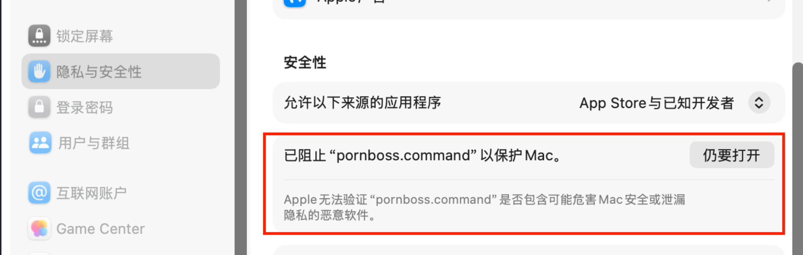
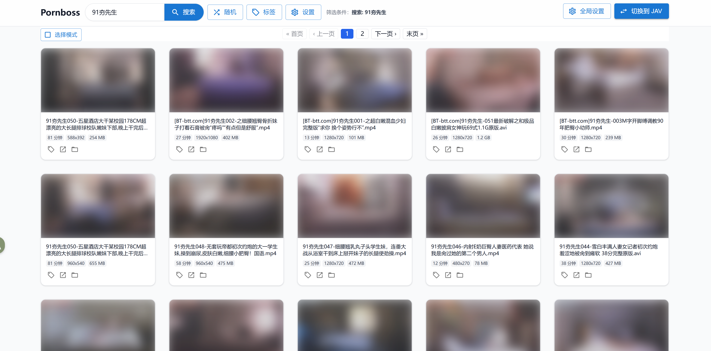

<h1 align="center">Pornboss</h1>

<p align="center">面向本地成人视频收藏的一站式解决方案，支持普通视频与日本 JAV 的整理、浏览与检索。</p>

<p align="center">
  <a href="https://github.com/JavBoss/pornboss/releases"></a>
  <a href="https://github.com/JavBoss/pornboss/stargazers"></a>
  <a href="https://github.com/JavBoss/pornboss/releases"></a>
  <a href="https://go.dev/"></a>
</p>

<p align="center">
  <a href="./README.md">中文</a> | <a href="./README.en.md">English</a>
</p>

## Keywords

porn manager, jav manager, av manager, jav scraper, jav metadata, adult video manager, pornhub, jav library, javbus, 91, 日本av 

## Why pornboss?

**如果你也有以下困扰，那么pornboss将是你的完美选择**：

- 我是个仓鼠症患者，下了一大堆片，很多都来不及观看，也不知道怎么整理。
- 我希望能向浏览javbus，javlibrary那样浏览我本地的jav（标签、封面、标题、演员）。
- 目前已有的本地jav搜刮整理方案都太复杂，不仅会修改目录内容，还要折腾各种第三方工具，让人身心俱疲。
- 我还有很多91的国产小视频，我希望给它们批量打上不同的标签，想看哪个合集就可以直接搜寻。
- 我希望视频播放更加快捷，点击立刻播放，而不是打开一个很重的本地播放器。
- 我希望有视频随机选取、展示功能。这样那些很久之前下载的被遗忘的视频也有机会能再次看到。

## 核心功能

- **开箱即用**
  不需要折腾任何复杂第三方工具，启动后添加目录就能开始扫描和整理，自动识别本地代理端口，小白也能轻松上手。

- **智能目录内容管理**
  支持多个资源目录，任何对目录内容的修改都会自动同步（新增、删除、移动文件），实时更新媒体库状态。绝对不会主动修改你目录里的任何内容，所有的相关数据维护在pornboss自己的目录中。

- **简单易操作**
  界面操作符合直觉，功能简洁但不简陋，没有各种冗余信息，追求快速定位视频和播放，

- **自动识别番号抓取元数据**
  从文件名提取 `IPX-633`、`SSIS-001`、`ipx633_ch` 这类常见格式，自动识别 JAV 作品，抓取元数据补全标题、发行时间、演员信息、作品标签，并自动下载封面。

- **女优视角浏览**
  不只按作品看，还可以按女优聚合浏览，快速进入某位女优的全部作品。女优信息也会自动抓取，支持多种方式排序（身高、年龄、三围等）

- **普通视频与 JAV 分开管理**
  自拍、合集、无码片段、短视频可以走普通视频库；番号片则进入 JAV 库，结构更清晰。

- **截图缩略图 + 可自定义快捷键的站内播放器**
  自动生成视频截图，浏览更高效；支持在页面里直接播放，也可以一键打开原文件或所在目录。站内播放器支持自定义快捷键，解放你的双手。

- **标签、搜索、随机、排序**
  支持批量打标签、批量替换标签、按标签筛选查询。支持按标签、番号、标题、女优、播放次数等多种方式筛选，并支持随机浏览和多种排序。


## 快速上手

### 1. 下载

前往仓库的  [Releases](https://github.com/JavBoss/pornboss/releases)  页面，下载适合你系统的版本并解压：

- `windows-x86_64`
- `linux-x86_64`
- `macos-x86_64`
- `macos-arm64`

### 2. 启动程序

- Windows：双击 `pornboss.exe`。
首次运行可能会被smartScreen阻止，点击更多信息->仍要运行。
- macOS：双击 `pornboss.command`。
如果提示`Apple无法验证“pornboss.command”是否包含可能危害Mac安全或泄漏隐私的恶意软件`，打开`系统设置`，选择`隐私与安全性`，滑到最底部，点击`仍要打开`。
<p align="center">
  
</p>

- Linux：打开终端运行 `pornboss`。
</br>

启动成功后，程序会自动尝试打开浏览器；如果没有自动打开，可以手动访问终端里显示的本地地址，运行过程中请不要关闭终端窗口。

### 3. 添加你的资源目录

进入“全局设置” -> “目录管理”，把存放视频的本地文件夹加进去。扫描过程在后台静默进行，已经入库的视频可以立刻开始用，无需等待扫描彻底完成。

### 4. 开始使用

- 在视频模式里管理普通成人视频
- 在 JAV 模式里按番号、作品、女优浏览
- 给常看内容打上“收藏”“中文字幕”“无码”“必看”等自定义标签
- 用搜索、随机和排序快速找到想看的内容

## 部分截图

<p align="center">
  
</p>

<p align="center">
  
</p>

<p align="center">
  
</p>

<p align="center">
  
</p>

<p align="center">
  
</p>

<p align="center">
  
</p>

<p align="center">
  
</p>

<p align="center">
  
</p>

## 如何升级版本

下载解压新版本之后，复制当前版本的data目录到新版本目录下即可（请注意数据备份，不建议直接剪切过去，可以选择平稳运行新版本一段时间之后再将旧版本目录删除，以防新版本有严重bug导致数据丢失）

## 注意事项

- 这是本地媒体库管理工具，不是在线视频站。
- JAV 元数据、封面和女优资料依赖外部站点可访问性，中国大陆地区请自备梯子。
- 首次导入大库时，扫描、封面抓取、资料补全需要一些时间。

## Q&A

- Q: 首次添加目录后，怎么知道扫描完成了，是否要一直等待？
- A: Pornboss的扫描是定期在后台自动持续进行的，添加目录后可以直接开始使用，信息会逐渐补全。你可以随时关闭应用程序，下次启动后扫描会自动重启。
</br>

- Q: 我有新下载的视频想入库，或者想移除一些不想看的视频，要怎么做？
- A: 只需要把视频移动进被管理的文件目录，或者从将视频从文件目录移除即可，pornboss会定期全量同步目录里的最新内容。总之你可以放心的随意整理目录，包括移动、新增、删除视频，不用担心数据丢失。
</br>

- Q: 我的视频文件夹放在移动硬盘里，扫描完成之后，下次启动pornboss时没有插移动硬盘，会导致移动硬盘里的视频索引数据丢失吗？
- A: 不会丢失，pornboss启动时会检查所有目录是否存在，并且已经入库的数据会长期存储，只要再次插入移动硬盘数据就会恢复。
</br>

- Q: 我想移动一个被管理的目录要怎么做？
- A: 直接移动，然后在目录管理里面修改目录地址。


## 开发者说明

### 开发环境依赖

- Go `1.25.1` 或更高版本
- Node.js 和 npm

### 技术栈

- Backend: Go + Gin + GORM + SQLite
- Frontend: React + Vite + Tailwind + Zustand
- 媒体探测: `ffmpeg` / `ffprobe`

### 常用命令

下载ffmpeg：

```bash
./scripts/cli.sh download ffmepg
```

安装前端依赖：

```bash
cd web
npm install
```

启动后端：

```bash
./scripts/cli.sh dev backend
```

启动前端：

```bash
./scripts/cli.sh dev frontend
```


前端检查

```bash
cd web
npm run lint
npm run build
```

打包发布

```bash
scripts/cli.sh release linux-x86_64 v0.1.0
```

### 项目结构

```text
cmd/server             Go 服务入口
internal/db            数据库读写与查询
internal/service       目录扫描、JAV 识别、女优资料补全
internal/server        HTTP API
internal/manager       封面下载、截图生成
internal/jav           JAV 元数据抓取
web/                   React 前端
scripts/cli            开发/发布辅助 CLI
data/                  运行期数据库与缓存
```

</details>
