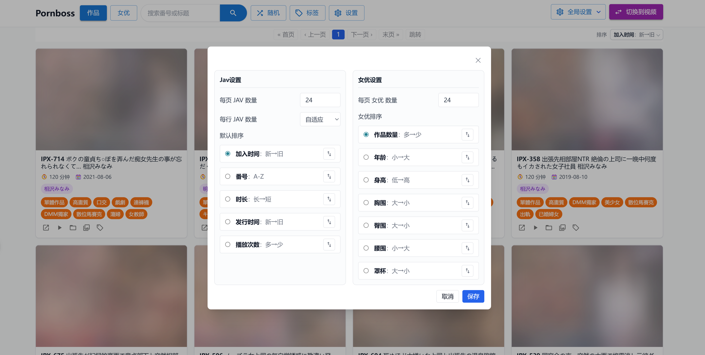
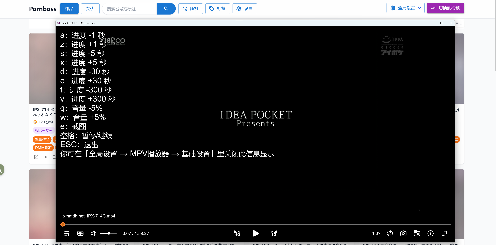
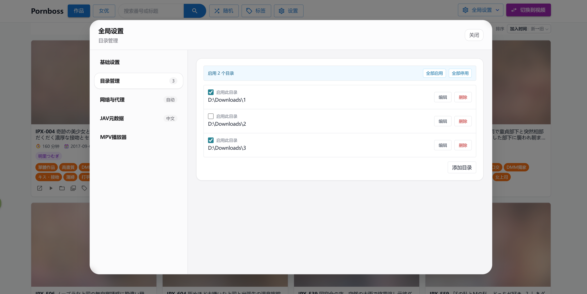
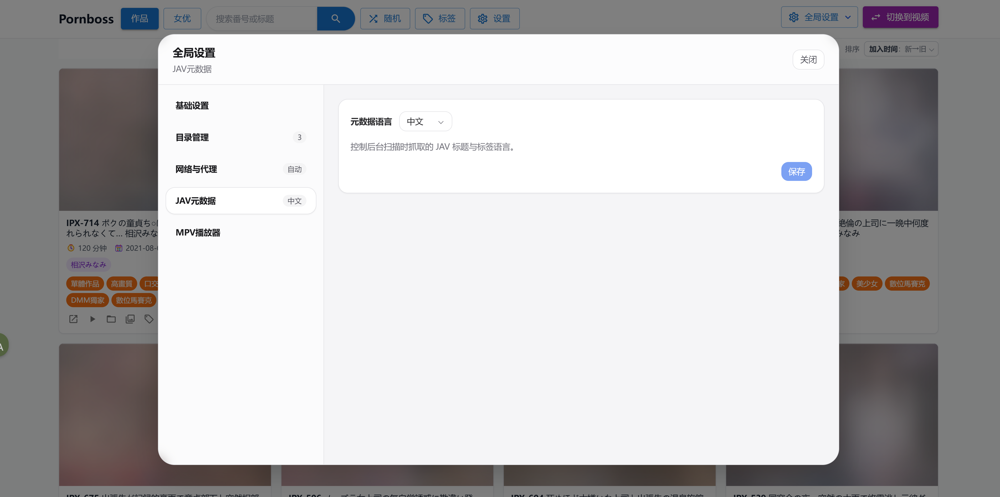
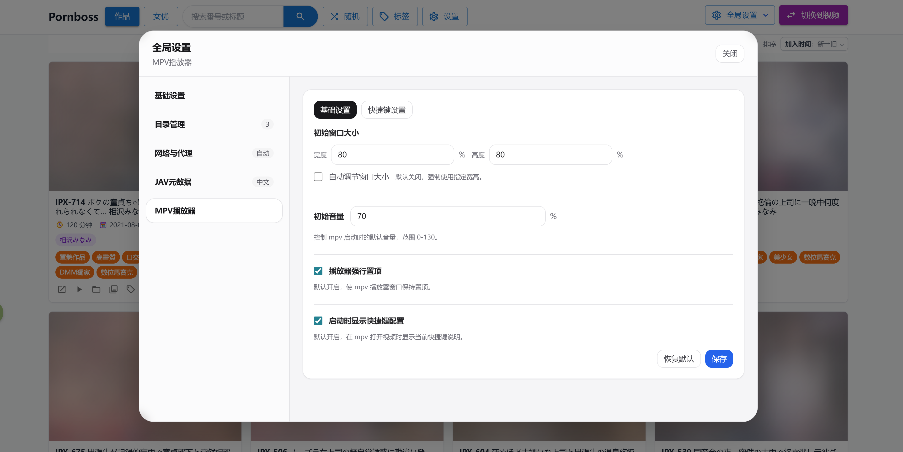
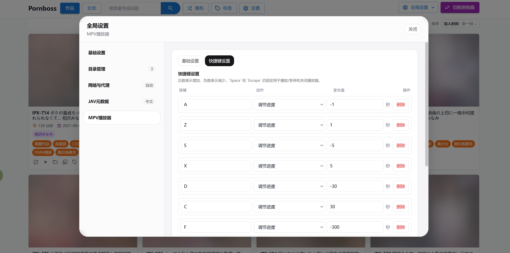

<strong>Pornboss includes native English support. For English documentation, see the <a href="./README.en.md">English README</a>.</strong>

<h1 align="center">Pornboss</h1>

<p align="center">面向本地成人视频收藏的一站式媒体库：自动识别 JAV、抓取元数据、管理目录与标签，并通过内置 mpv 快速播放。</p>

<p align="center">
  <a href="https://github.com/JavBoss/pornboss/releases"></a>
  <a href="https://github.com/JavBoss/pornboss/stargazers"></a>
  <a href="https://github.com/JavBoss/pornboss/releases"></a>
  <a href="https://go.dev/"></a>
</p>

<p align="center">
  <a href="./README.md">中文</a> | <a href="./README.en.md">English</a>
</p>

## Keywords

porn manager, jav manager, av manager, jav scraper, jav metadata, adult video manager, pornhub, jav library, javbus, 91, 日本av

## Pornboss 是什么？

Pornboss 是一个本地媒体库管理工具，适合管理大量本地成人视频、JAV、短视频、合集与移动硬盘资源。它不会修改你的视频目录内容，而是把扫描索引、标签、封面、缩略图和元数据统一保存在项目的 `data/` 目录中。

如果你希望像浏览 JavBus / JavLibrary 一样浏览自己的本地收藏，又不想手动改文件、整理 NFO、配置一堆工具，Pornboss 会把这些流程集中到一个简单的 Web UI 里。

## 核心功能

### 1. JAV 自动识别与元数据抓取

Pornboss 会从文件名中自动提取番号，例如 `IPX-633`、`SSIS-001`、`ipx633_ch` 等常见格式，并将识别出的影片归入 JAV 媒体库。

- 自动抓取作品标题、发行时间、封面、演员、标签等 JAV 信息。
- 自动抓取并补全女优信息，支持按女优聚合浏览本地作品。
- 支持中英文Jav元数据抓取，可自由切换。
- 支持按番号、标题、女优、标签、时长、发行时间、播放次数等条件筛选和排序。
- 普通视频和 JAV 分开管理，自拍、短视频、合集、无码片段不会和番号作品混在一起。

### 2. 智能目录管理与可迁移数据

添加本地视频目录后，Pornboss 会在后台持续同步目录内容。目录变化会被持续感知并及时刷新，新增、删除、移动文件都会自动反映到媒体库中，已经入库的视频可以立即浏览，扫描和资料补全会逐步完成。

- 支持多个资源目录，适合本机硬盘、NAS 挂载目录、移动硬盘等场景。
- 可任意选择启用目录，未启用的目录内容自动隐藏。
- 目录不可用时不会删除历史索引，移动硬盘重新接入后数据会恢复显示。
- 标签、JAV 关联和视频指纹绑定，常见的视频移动、改名场景不用重新打标签。
- 数据库、封面、缩略图等运行数据集中保存在 `data/`，升级或迁移时复制 `data/` 目录即可。

### 3. 内置 mpv 播放器

Pornboss 集成 mpv 播放能力，点击视频即可调用轻量、高性能的本地播放器，适合播放大文件、高码率和各种常见视频格式。

- 通过 mpv 播放原始本地文件，避免浏览器格式兼容性限制。
- 支持默认音量、窗口尺寸、置顶等播放配置。
- 支持自定义快捷键，例如快进、快退、音量调整等。
- 自带 [ModernZ](https://github.com/Samillion/ModernZ) OSC 脚本，mpv 播放时默认使用更现代的播放器控制界面。
- 使用 mpv 播放时可随时截图，截图按视频保存在 `data/video/{video_id}/screenshot/`。
- 在普通视频库和 JAV 作品库中都可以打开截图面板，按时间顺序预览所有 mpv 截图。
- 截图面板支持放大预览、删除截图，并可直接从某张截图对应的时刻继续播放。
- 可在全局设置中选择默认播放器，支持使用 mpv 或系统播放器播放视频，并可定位到文件所在目录。

### 4. 简单易用的 UI

前端界面围绕“快速找到想看的视频”设计，不堆复杂设置，把常用操作放在筛选、排序、标签和随机浏览上。

- 支持普通视频库、JAV 作品库、女优视角浏览。
- 支持搜索、标签筛选、多选批量打标签、批量替换标签。
- 支持随机浏览，让很久没看的旧视频重新浮现。
- 支持按最近加入、文件名、时长、发行时间、播放次数等维度排序。

## 快速上手

### 1. 下载

前往 [Releases](https://github.com/JavBoss/pornboss/releases) 页面，下载适合你系统的版本并解压：

- `windows-x86_64`
- `linux-x86_64`
- `macos-x86_64`
- `macos-arm64`

### 2. 启动程序

- Windows：双击 `pornboss.exe`。首次运行可能会被 SmartScreen 阻止，点击“更多信息” -> “仍要运行”。
- macOS：双击 `pornboss.command`。如果提示无法验证，打开“系统设置” -> “隐私与安全性”，滑到最底部点击“仍要打开”。
<p align="center">
  
</p>

- Linux：打开终端运行 `pornboss`。

启动成功后，程序会自动尝试打开浏览器。如果没有自动打开，可以手动访问终端里显示的本地地址。运行过程中请不要关闭终端窗口。

发布包根目录会包含 `config.toml` 文件。默认 `port = 0`，启动时使用随机端口；如果需要固定端口，改成例如：

```text
port = 17654
```

### 3. 添加资源目录

进入“全局设置” -> “目录管理”，添加存放视频的本地文件夹。扫描任务会在后台运行，已入库的视频可以直接使用，不需要等待全部扫描完成。

### 4. 开始使用

- 在顶部目录下拉菜单或“目录管理”中勾选想看的目录。
- 在“视频”模式管理普通成人视频、短视频和合集。
- 在“JAV”模式按番号、作品、标签和女优浏览。
- 给常看内容打上“收藏”“中文字幕”“无码”“必看”等自定义标签。
- 使用搜索、筛选、排序和随机浏览快速定位内容。

## 部分截图

<p align="center">
  
</p>

<p align="center">
  
</p>

<p align="center">
  
</p>

<p align="center">
  
</p>

<p align="center">
  
</p>

<p align="center">
  
</p>

<p align="center">
  
</p>

<p align="center">
  
</p>

<p align="center">
  
</p>

<p align="center">
  
</p>

<p align="center">
  
</p>

<p align="center">
  
</p>

## 如何升级版本

下载并解压新版本后，把旧版本目录中的 `data/` 复制到新版本目录即可。建议先保留旧版本和旧数据备份，确认新版本稳定运行后再清理旧目录。

## 注意事项

- Pornboss 是本地媒体库管理工具，不是在线视频站。
- JAV 元数据、封面和女优资料依赖外部站点可访问性，中国大陆地区请自备梯子。
- 首次导入大库时，扫描、封面抓取、资料补全和缩略图生成需要一些时间。
- Pornboss 不会主动修改你的视频文件和目录结构，索引与扩展数据保存在 `data/`。

## Q&A

- Q: 为什么要做本地web应用而不做桌面端应用？
- A: 这不是技术问题，纯粹是从用户体验角度出发。比如说以下场景都是浏览器的独有优势：
  1. 想同时查看 女优A、女优B的jav，并检索包含关键词C的视频，只要打开多个浏览器标签即可。
  2. 在当前页面想点击查看一个新页面内容，又不想丢失当前页，直接ctrl+鼠标左键或者右键点击选择在新页面中打开。
  3. 不小心点错了，想回到上一页的内容，直接点击浏览器回退按钮。
  4. 看到一个Jav或者女优，想检索一下相关信息，直接鼠标拖动选中文本，右键选择在Google中检索。


<br>

- Q: 添加目录后，怎么知道扫描完成了？需要一直等待吗？
- A: 不需要。Pornboss 会在后台持续扫描和补全信息，添加目录后可以直接开始使用。你也可以随时关闭应用，下次启动后扫描会继续。

<br>

- Q: 添加目录后，为什么我的jav视频出现在了普通视频模式中？
- A: 这是正常现象，jav元数据抓取相比于视频扫描有一定的延迟，所以jav视频也会被先当作普通视屏，只要你的外网访问通畅，稍等片刻此视频就会在普通模式中消失并出现在jav模式中。

<br>

- Q: 新下载的视频怎么入库？想删除一些视频怎么办？
- A: 直接把视频移动进或移出被管理的目录即可。Pornboss 会同步目录状态，新增、移动、删除都会反映到媒体库。

<br>

- Q: 视频文件夹在移动硬盘里，没插硬盘时启动会丢数据吗？
- A: 不会。目录不可用时，Pornboss 会保留已入库数据；移动硬盘再次接入后，数据会恢复显示。

<br>

- Q: 某个移动硬盘不够大了，文件夹要移动到新的硬盘里怎么办？
- A: 直接移动文件夹，然后在“目录管理”里更新目录路径，不用担心数据丢失，pornboss会处理好这一切。

<br>

- Q: 换电脑时怎么迁移？
- A: 同系统迁移直接复制整个pronboss目录到新电脑即可运行。跨系统迁移在新电脑下载对应系统的pornboss，然后将旧电脑的`data/`目录复制到新电脑的pornboss目录下即可。（注意如果视频目录也发生了变化，你还需要手动在目录管理中进行调整）

## 开发者说明

### 开发环境依赖

- Go `1.25.1` 或更高版本
- Node.js 和 npm

### 技术栈

- Backend: Go + Gin + GORM + SQLite
- Frontend: React + Vite + Tailwind + Zustand
- 媒体探测: `ffprobe`
- 缩略图截图生成: macOS 使用 `ffmpeg`，其他平台使用 `mpv`
- 播放与手动截图: `mpv`

### 常用命令

下载依赖（`ffprobe` + `mpv`，macOS 额外下载 `ffmpeg`）：

```bash
./scripts/cli.sh download linux-x86_64
```

安装前端依赖：

```bash
cd web
npm install
```

启动后端：

```bash
./scripts/cli.sh dev backend
```

启动前端：

```bash
./scripts/cli.sh dev frontend
```

前端检查：

```bash
cd web
npm run lint
npm run build
```

打包发布：

```bash
scripts/cli.sh release linux-x86_64 v0.1.0
```

### 项目结构

```text
cmd/server             Go 服务入口
cmd/javprovider        JAV 元数据 provider 调试入口
internal/common        全局状态与共享配置
internal/db            GORM 模型查询与 SQLite 存储
internal/jav           JAV 元数据与女优资料抓取
internal/manager       封面下载与截图任务
internal/models        数据模型定义
internal/mpv           mpv 播放、快捷键与手动截图配置
internal/server        HTTP API 与静态资源路由
internal/service       目录扫描、JAV 识别、资料补全
internal/util          文件、系统、代理、视频探测等工具
web/                   React + Tailwind 前端
scripts/cli            开发、依赖下载与发布辅助 CLI
data/                  运行期数据库、封面、缩略图与缓存
```
